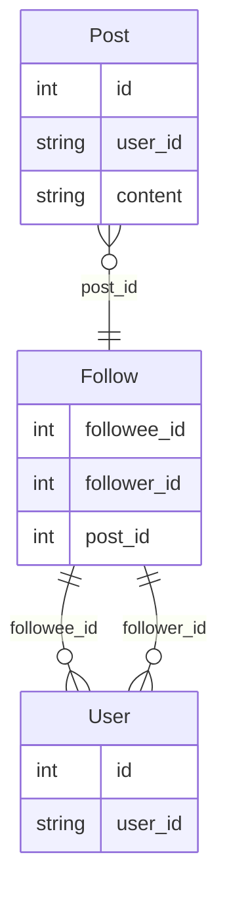

# MicroBlog

A minimal Spring Boot application that powers a Twitter‑lite micro‑blogging API.

Storage is **SQLite** (`microblog.db`) via Spring Data JPA.

## Requirements

- JDK 17+
- Maven 3.9+

## Running locally

```bash
mvn clean spring-boot:run
```

The API starts on <http://localhost:8080> and auto‑creates `microblog.db`.

Swagger UI is available at <http://localhost:8080/swagger-ui/index.html>.

### Tests

Basic Spring Boot & JPA tests are pre‑wired (see `src/test/java`).

```bash
mvn clean test
```

### ER Diagram



